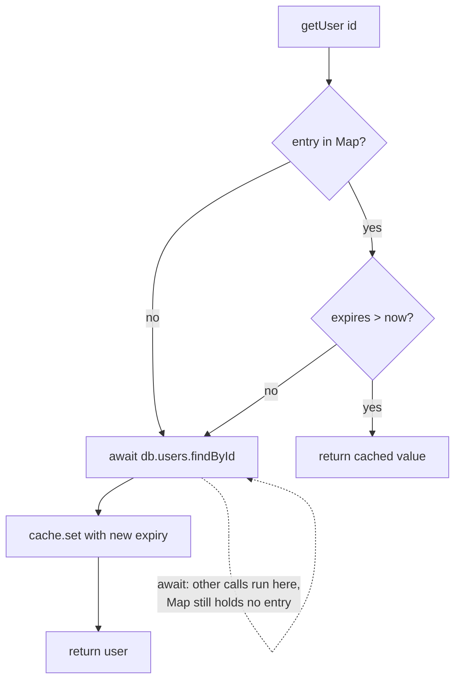

# Worked example

One complete pass of the 5-part contract over real code, followed by the generic
output this skill exists to prevent. Read the two side by side: the difference is
not length, it is whether a reader could act on it.

## The code under explanation

```ts
// src/cache/userCache.ts
const cache = new Map<string, { value: User; expires: number }>();
const TTL_MS = 30_000;

export async function getUser(id: string): Promise<User> {   // L4
  const hit = cache.get(id);                                  // L5
  if (hit && hit.expires > Date.now()) return hit.value;      // L6

  const user = await db.users.findById(id);                   // L8
  cache.set(id, { value: user, expires: Date.now() + TTL_MS });
  return user;                                                // L10
}

// src/api/team.ts
export async function renderTeam(memberIds: string[]) {       // L14
  const members = await Promise.all(memberIds.map(getUser));  // L15
  return members.map(toCard);                                 // L16
}
```

---

## 1. Mental Anchor

A **will-call counter at a warehouse**. A clerk keeps the most-requested boxes on
a shelf behind the desk instead of walking to the aisles every time. The shelf is
the cache; the walk to the aisle is the database query; the 30-second TTL is the
clerk's rule that a box older than half a minute might be stale, so they walk
again.

The pattern exists because the walk is thousands of times more expensive than
reaching behind the desk — not because the data is precious.

**Where the analogy breaks:** a human clerk serves one customer at a time. This
code serves many concurrently, and that difference is the entire bug in section 4.

## 2. Visual Architecture



The dotted self-edge is the point of the diagram: `await` on L8 is a suspension
point, and nothing was written to the `Map` before it.

## 3. Data Flow & Contract Lifecycle

- **Input:** `id: string`. No validation — an empty string is a valid `Map` key
  and will be cached like any other.
- **Transformations:**
  - `userCache.ts:L5` — `Map.get` returns the entry or `undefined`.
  - `userCache.ts:L6` — freshness check. Note `hit &&`: a missing entry and an
    expired entry take the same branch.
  - `userCache.ts:L8` — the only I/O. Suspends the function.
  - `userCache.ts:L9` — write-back, unconditional.
- **Output:** `Promise<User>`.
- **Side effects:** mutates module-level `cache`. The `Map` is never pruned, so
  it grows with the number of distinct ids seen for the lifetime of the process.

## 4. Failure Modes & Gotchas

**Cache stampede on cold start.** `renderTeam` is called with 50 member ids
(`team.ts:L15`). `Promise.all` invokes `getUser` 50 times synchronously before
any of them resumes. All 50 read an empty `Map` at L5, all 50 miss, all 50 reach
L8 — **50 database queries for 50 users, with a cache that reports a 0% hit
rate.** The cache does not fail loudly; it silently does nothing on exactly the
workload it was added for.

Root cause: the entry is written *after* the await (L9), so the in-flight query
is invisible to concurrent callers. The fix is to cache the **promise**, not the
resolved value, so the second caller awaits the first caller's query.

**Unbounded growth.** Expired entries are overwritten only when the same id is
requested again. An id requested once stays in the `Map` forever. On a process
with high id cardinality this is a slow leak, not a cache.

## 5. Verification Vector

Targets the stampede directly — a single-call test would pass on the broken code.

```ts
it('issues one query for concurrent requests of the same id', async () => {
  const spy = vi.spyOn(db.users, 'findById')
    .mockImplementation(() => delay(10).then(() => ({ id: 'u1' })));

  await Promise.all([getUser('u1'), getUser('u1'), getUser('u1')]);

  expect(spy).toHaveBeenCalledTimes(1);   // fails on the code above: 3
});
```

Run it before the fix. It must go red, or it is not testing what you think.

---

## The anti-example

The output the contract forbids:

> This function implements a caching layer for user lookups. It first checks
> whether the user is present in the cache and returns it if so. Otherwise it
> queries the database, stores the result in the cache with a TTL of 30 seconds,
> and returns it. This is a common and efficient pattern that reduces database
> load and improves performance. Note that you may want to consider adding
> error handling and being careful about potential race conditions.

Everything in it is true. It is still worthless:

- It restates the syntax the reader can already see.
- "Potential race conditions" names a category, not the scenario — it does not
  say that 50 concurrent calls produce 50 queries, which is the whole point.
- It cites no line.
- It offers no way to check any of it.

A reader who acts on this paragraph ships the bug.
